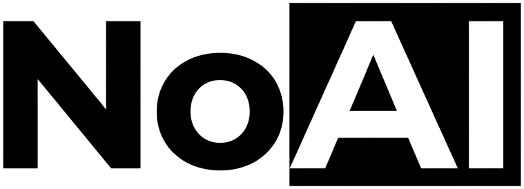

<div align="center">
  
  <h1>NoAI</h1>
  <p><b>Browser-only deterministic redaction for preparing documents before they are sent to AI tools.</b></p>
  
  [](./LICENSE)
  [](#)
  [](#)
</div>

<br />

NoAI is for people who want to use AI assistants without first handing over raw private documents. The app reads files locally in the browser, applies inspectable rule-based redaction, and exports Markdown that can be pasted into other AI tools.

**It does not upload files, call AI APIs, or store document contents.**

---

## 🛡️ Why This Exists

Commercial AI tools are useful, but many people and small teams are uncomfortable pasting sensitive contracts, pleadings, correspondence, due diligence notes, or internal documents into them. Enterprise private AI servers are not realistic for everyone.

NoAI takes a simpler path: **remove likely sensitive information before the document ever reaches an AI provider.**

The goal is not perfect anonymization. The goal is a fast, understandable pre-processing step that reduces obvious privacy risk while keeping the resulting document readable enough for AI-assisted summarization, drafting, analysis, and search.

## ✨ Features

- **Local Execution:** Files are parsed and redacted entirely in the user's browser process. No backend endpoint, no AI API call path.
- **Multiple Inputs:** Supports `.md`, `.txt`, `.docx`, and text-based `.pdf`.
- **Markdown Output:** Exports combined Markdown and per-document sanitized previews.
- **Batch Processing:** Drop multiple files and export one combined Markdown pack.
- **Customization:** Custom terms are supported and replaced deterministically.

### Redaction Levels
- **Light:** Direct identifiers (emails, phone numbers, URLs, addresses, postcodes, national/business IDs, bank details, and case/registry references).
- **Balanced** *(Default)*: Light + people, organizations, matter names, dates, amounts, and locations.
- **Heavy:** Balanced + aggressive repeated proper-noun capture and heavier table/contact quarantining.

## 🔒 Trust Model

The main design constraint of NoAI is complete transparency and local processing:

- ❌ No server-side document processing.
- ❌ No AI/LLM calls in the redaction path.
- ❌ No analytics over document contents.
- ❌ No logging of document contents.
- ❌ No remote OCR or conversion service.

The source code is kept small and auditable so non-expert users can reasonably trust the public claim: documents are processed locally. 

### The Engine
The redaction engine is rule-based:
- **Direct patterns:** emails, phone numbers, URLs, addresses, postcodes, national IDs (SSN, NI, passport), employer IDs, bank details (IBAN, SWIFT/BIC, sort code), case references (including UK neutral citations and US dockets), bundle/exhibit references, transcript references, procedural references, dates, amounts, percentages.
- **Context patterns:** legal contact labels, addresses, titled names, witness-style aliases, all-caps party names, organization suffixes, known legal/finance organizations, locations, and matter-specific deal terms.

> **Note: What It Is Not**
> NoAI is not a legal-grade redaction system and should not be used as the only protection before publishing documents, producing documents in litigation, or disclosing information to counterparties. It can miss unusual names, implicit identifiers, rare address formats, and sensitive context that only a human would understand. **For high-risk use, review the output before sharing it.**

## 💻 Development

The app is built with Vite and TypeScript.

```bash
# Install dependencies
npm install

# Run engine unit tests
npm test

# Start the dev server locally
npm run dev

# Build the static site
npm run build
```

### Verification & Testing
- Dependency audit: `npm audit --audit-level=moderate`
- During early development, the detector was also tested against private English legal/business documents (not included in this repository). Public regression tests use synthetic examples that preserve patterns without exposing private facts.

### Engine Versioning
The redaction engine is versioned separately from the app package. The current engine version lives in `src/redactor/version.ts`, and changes are summarized in `docs/engine-changelog.md`.

We use semantic versioning for the engine:
- **Patch:** narrow false-positive/false-negative fixes or small rule tuning.
- **Minor:** new document family coverage, new detector category, or compatible review metadata.
- **Major:** incompatible output, API, replacement-token, or redaction-level semantics changes.

To enable the local commit guard to ensure changelogs are updated:
```bash
npm run hooks:install
```

## 🗺️ Roadmap

- [ ] Improve English legal and business document detection rules.
- [ ] Add a clearer report showing what was redacted and why.
- [ ] Add safer PDF handling notes for scanned-image PDFs that need OCR before redaction.
- [ ] Add export options beyond Markdown only if they do not weaken the browser-only trust model.
- [ ] Improve the interface after the redaction logic is mature.

## ⚖️ License

GNU Affero General Public License v3.0 only (`AGPL-3.0-only`). See [LICENSE](./LICENSE).

In plain terms: you can use, study, modify, and share NoAI, but if you modify it and offer it to users over a network, you must make your modified source code available under the same license.
